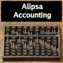

#  Alipsa Accounting


Desktopbaserat bokföringsprogram för små svenska företag.
Byggt med Groovy, Swing och en inbäddad H2-databas — inga externa tjänster behövs.

Programmet hanterar löpande bokföring, moms, rapporter, SIE-utväxling och årsbokslut.
Det är inte ett komplett affärssystem — fakturering, lönehantering, bankintegration och årsredovisningsflöden ingår inte.

## Funktioner

- **Flerföretagsstöd** — skapa och växla mellan flera företag i samma installation. Varje företag har egen kontoplan, egna räkenskapsår, nummerserier, hashkedjor och rapportarkiv. Data isoleras fullständigt via `company_id` i datamodellen.
- **Kontoplan** — BAS-baserad kontoplan med import från Excel och automatisk klassificering. Kontoplanen är företagsspecifik — två företag kan ha samma BAS-kontonummer utan konflikt.
- **Räkenskapsår och perioder** — skapa år, dela in i perioder och lås perioder när de är klara.
- **Verifikationer** — registrera, bokför och korrigera verifikationer med bilagor.
- **Moms** — beräkna, rapportera och bokför momsöverföring per period. Stöder månads-, kvartals- och årsmoms.
- **Rapporter** — generera verifikationslista, huvudbok, provbalans, resultat- och balansrapport, transaktionsrapport och momsrapport som PDF eller CSV. Rapporter arkiveras med checksumma.
- **SIE4** — importera och exportera bokföringsdata via SIE4 med dubblettskydd och integritetskontroll.
- **Bokslut** — stäng räkenskapsår med bokslutsverifikation och automatisk generering av nästa års ingående balanser.
- **Revisionskedja** — alla väsentliga händelser loggas i en hashkedja för spårbarhet.

### Avgränsningar

Följande funktioner ingår inte i v1.0.x:

- Fakturering och lön
- Bankintegration
- Årsredovisningsflöden
- Anläggningsregister (planerat till v1.1.0)
- Förbättrad kraschsäker bilagehantering (planerat till v1.1.0)

## Förutsättningar

- Java 21 eller senare

## Kom igång

```bash
git clone https://github.com/Alipsa/accounting.git
cd accounting
./gradlew run
```

Applikationen skapar sin H2-databas automatiskt vid första start.

## Bygg och kör

- `./gradlew build` kör full validering med kompilering, tester, Spotless och CodeNarc.
- `./gradlew test` kör testsviten.
- `./gradlew run` startar desktopapplikationen.
- `./gradlew :app:packageCurrentPlatformRelease` bygger releasepaket för aktuell plattform via `jpackage`.
- `./gradlew :app:verifyCurrentPlatformRelease` paketerar aktuell plattform och verifierar att launchern kan starta applikationen i ett isolerat hemkatalogsläge.

## Utveckling

### Projektstruktur

```
app/src/main/groovy/se/alipsa/accounting/
├── domain/          # domänmodeller
├── service/         # databas- och affärslogik
├── ui/              # Swing-paneler och dialoger
└── support/         # hjälpklasser

app/src/main/resources/
├── db/migrations/   # SQL-migrationer
└── reports/         # FreeMarker-mallar för PDF-rapporter

app/src/test/groovy/
├── unit/            # enhetstester
├── integration/     # integrationstester
└── acceptance/      # acceptanstester

req/                 # kravdokumentation och färdplan
```

### Kommandon för utvecklare

```bash
./gradlew build          # kompilering, tester, Spotless och CodeNarc
./gradlew test           # kör enbart tester
./gradlew spotlessApply  # auto-formatera kod
./gradlew spotlessCheck  # kontrollera formatering utan att ändra
./gradlew codenarcMain   # statisk analys på produktionskod
```

Kör alla kommandon från rotmappen.

### Teknikstack

| Komponent     | Teknologi                               |
|---------------|-----------------------------------------|
| Språk         | Groovy (`@CompileStatic`)               |
| UI            | Swing med flatlaf look and feel         |
| Databas       | H2 (inbäddad)                           |
| PDF-rapporter | Alipsa Journo (FreeMarker + HTML → PDF) |
| SIE-parsning  | Alipsa SieParser                        |
| Bygg          | Gradle 9.4                              |
| Kodstil       | Spotless + CodeNarc                     |
| Tester        | JUnit 6 + groovier-junit                |

## Drift och säkerhet

- Applikationen använder endast embedded H2 i fil-läge.
- Databasen, bilagor, rapportarkiv, loggar, backups och exporterad dokumentation lagras under applikationskatalogen i användarens profil.
- Startup-verifiering kontrollerar driftkonfiguration och integritet för hashkedjor, bilagor och rapportarkiv.
- Känsliga operationer som rapportexport, SIE-export, backup och årsstängning blockerar på kritiska integritetsfel.
- Bokföringsdata, bilagor och rapportarkiv omfattas av sju års bevarandespärr.

## Backup och restore

- Backupformatet är ZIP med:
  - H2 `SCRIPT`-dump
  - `manifest.txt` med schema-version och checksummor
  - bilagearkiv
  - rapportarkiv
- Restore verifierar manifest och checksummor innan data och filarkiv återskapas.
- Backup och restore kan köras från fliken `System`.

## Dokumentation

- Fliken `System` visar diagnostik, backup/restore och inbyggd systemdokumentation.
- Hjälpmenyn öppnar användarmanualen från `app/src/main/resources/docs/user-manual.md`.

## Release

### Nedladdningar

Varje release publiceras på [GitHub Releases](https://github.com/Alipsa/accounting/releases) med tre användardistributioner och ett generiskt uppdateringsarkiv:

| Fil                                       | Plattform                                                             |
|-------------------------------------------|-----------------------------------------------------------------------|
| `alipsa-accounting-<version>-linux.zip`   | Linux — app-image, `.desktop`-fil och `skill/accounting-mcp.md`       |
| `alipsa-accounting-<version>-windows.zip` | Windows — exe-installerare och `skill/accounting-mcp.md`              |
| `alipsa-accounting-<version>-macos.zip`   | macOS — `AlipsaAccounting.app` och `skill/accounting-mcp.md`          |
| `app-<version>.zip`                       | Generiskt arkiv som används av den inbyggda automatiska uppdateraren  |

Varje distributionsfil åtföljs av två verifieringsfiler:

- **`.sha256`** — SHA-256-kontrollsumma. Verifiera att nedladdningen är intakt:
  ```
  sha256sum -c alipsa-accounting-<version>-linux.zip.sha256
  ```
- **`.asc`** — GPG-signatur. Verifiera att filen är publicerad av releaseansvarig:
  ```
  gpg --verify alipsa-accounting-<version>-linux.zip.asc alipsa-accounting-<version>-linux.zip
  ```

För vanliga användare räcker det att ladda ner distributionsfilen. Verifieringsfilerna riktar sig till den som vill kontrollera filens integritet och äkthet.

### Artifact verification and signing

Released artifacts are accompanied by SHA-256 checksum files and GPG signatures so the download can be verified after publication.

The project does not currently ship platform-trusted code signatures for Windows or notarized/signature-stamped macOS app bundles. Users on those platforms may therefore see the standard unsigned-application warnings from the operating system.

- Committers and reviewers: repository contributors with write access to the project. Public contribution history: [Contributors](https://github.com/Alipsa/accounting/graphs/contributors)
- Release approvers: project maintainers responsible for publication. Current project home page: [Alipsa/accounting](https://github.com/Alipsa/accounting)
- Privacy policy: [docs/privacy-policy.md](docs/privacy-policy.md)

The application stores accounting data locally on the user's system.

The application does not upload accounting records, attachments, reports, backups, or exported files to project-operated servers.

The application can perform a background update check against GitHub Releases on startup, and may download release artifacts from GitHub when the user explicitly chooses to install an update. Automatic update checks can be disabled in Settings. See the privacy policy for details.

### Bygga en release

Releasebyggen använder `jpackage` och kräver Java 21 med tillhörande paketeringsverktyg på respektive plattform.

- Linux: `./gradlew :app:packageLinuxReleaseZip`
- Windows: `./gradlew :app:packageWindowsRelease`
- macOS: `./gradlew :app:packageMacosRelease`
- Aktuell plattform: `./gradlew :app:packageCurrentPlatformRelease`
- Smoke test av aktuell plattform: `./gradlew :app:verifyCurrentPlatformRelease`

Om Gradle hittar fel JDK för jpackage (t.ex. en inbäddad JDK utan jpackage) kan sökvägen sättas explicit:

```
./gradlew :app:verifyCurrentPlatformRelease -Pjpackage.executable=/path/to/jdk-21/bin/jpackage
```

Byggartefakter skrivs till `app/build/release/` och använder samma appnamn, versionsnummer och ikonuppsättning för alla tre plattformar.

Alla tre plattformsreleaserna producerar ett zip-arkiv som innehåller `skill/accounting-mcp.md`. Linux-arkivet innehåller app-imagen och installationsskripten. Windows-arkivet innehåller exe-installeraren med meny- och skrivbordsgenväg. macOS-arkivet innehåller `AlipsaAccounting.app`.

Claude Code och Codex läser inte automatiskt `skill/`-katalogen; extrahera arkivet och länka eller kopiera den till klientens skill-katalog:

```
# Claude Code
ln -s /path/to/release/skill ~/.claude/skills/accounting

# Codex
ln -s /path/to/release/skill ~/.agents/skills/accounting

# Windows PowerShell, Claude Code
New-Item -ItemType Junction -Path "$HOME\.claude\skills\accounting" -Target "C:\path\to\release\skill"

# Windows PowerShell, Codex
New-Item -ItemType Junction -Path "$HOME\.agents\skills\accounting" -Target "C:\path\to\release\skill"
```

Applikationen använder plattformsspecifika standardvägar för data och loggar:

- Linux: `~/.local/share/alipsa-accounting`
- Windows: `%APPDATA%\\Alipsa\\Accounting`
- macOS: `~/Library/Application Support/AlipsaAccounting`

Signering av Windows-installatör och notarisering/signering av macOS-app är avsiktligt lämnade som framtida release-steg. Nuvarande buildflöde producerar signerbara artefakter men utför inte signering automatiskt.
